# 🧭 ハードウェア設計・実装構成

本章では、**S310** 機体搭載用の計測システムにおけるハードウェア構成・実装方針をまとめる。
計測システムは、**配線簡略化と信頼性向上**を最優先目標として設計されており、主要デバイスには**I²C 通信**を採用し、機器接続には**XH コネクタ**を統一的に使用することで、**振動耐性・防水性と高い整備性・交換性**を確保した。

## 1. 計測機器一覧と仕様

<!--TODO:センサー正しいか確認-->

S310 機体では、以下のセンサー群を搭載した。 各計器の選定理由、通信方式、設置場所および主要仕様を表に示す。

| **計測項目** | **センサー名** | **通信方式** | **設置位置** | **主な仕様・備考** |
| :--- | :--- | :--- | :--- | :--- |
| **高度計** | [MB1242-000](https://akizukidenshi.com/catalog/g/g114709/) | I²C | フェアリング下部 | 測距範囲 20–765cm。地面反射を利用した高度算出。 |
| **機速計** | [ピトー管](https://amzn.asia/d/ecEdyK8) + [SDP810-500Pa](https://www.mouser.jp/ProductDetail/Sensirion/SDP810-500PA) | I²C | テールビーム | 差圧式。ベルヌーイの定理より動圧から速度換算。 |
| **姿勢角計** | [BNO085](https://www.amazon.co.jp/dp/B0DM98Q67M) | I²C | TB 基板上 | 9 軸（加速度・角速度・地磁気）統合センサ。四元数出力対応。 |
| **舵角計** | [CJMCU-103](https://amzn.asia/d/fbYAGlM) | アナログ | ER 機構部 | 可変抵抗方式。舵軸角度を電圧変換して出力。 |

## 2. 設計方針と通信構成

本システムの設計は、信頼性と整備性の向上を中核に据えている。

通信バスは、主要センサーに I²C 通信を採用することで、配線を 4 本（VCC, GND, SDA, SCL）に統一した。これにより、配線総量を削減し、機体内部のスペース効率と整備性を大幅に向上させた。アナログ出力（舵角計など）は、直接 ADC 入力として基板に接続する構成とした。

電源系統は、ESP32 および LCD1602（5V 駆動）を除き、すべてのセンサーを 3.3V 系統で駆動するよう統一した。

接続インタフェースには XH コネクタを採用した。これにより、極性間違いを防止するとともに確実な嵌合（かんごう）を実現し、飛行中の振動環境下や雨天環境下でも安定した動作を確保した。

## 3. 機器配置と実装

全体の計器配置図を以下に示す。 

#### 高度計（超音波センサー）

フェアリング下部に下向きに設置し、地面反射を利用して離陸直後から高度を検知可能である。測定レンジ外（20cm 未満、765cm 超）での精度低下を考慮し、補正ロジックをファームウェアに実装した。

#### 機速計（ピトー管 + 差圧センサー）

テールビーム先端にピトー管を配置し、静圧ポートとの差圧を[SDP810-500Pa](https://www.mouser.jp/ProductDetail/Sensirion/SDP810-500PA)で検出する。流線の乱れを最小化するため、プロペラや翼の影響が少ないテールビーム後部に設置した。

#### 姿勢角計（BNO080）

TB 基板上に実装し、機体座標系に対して固定する。9 軸統合センサー出力からクォータニオンを生成し、姿勢角（ピッチ・ロール・ヨー）をリアルタイム算出する。

#### 舵角計（可変抵抗）

ER 可動部の回転軸に連結する。可動角を電圧値に変換し、ESP32 の ADC に入力してデジタル値へ変換する。

| | **基板設置場所** |
| :--- | :--- |
| メイン基板 | 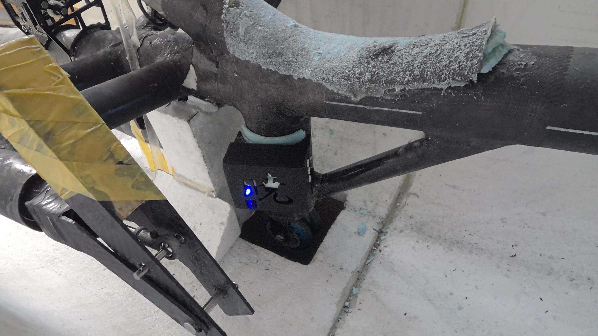 |
| TB 基板 | 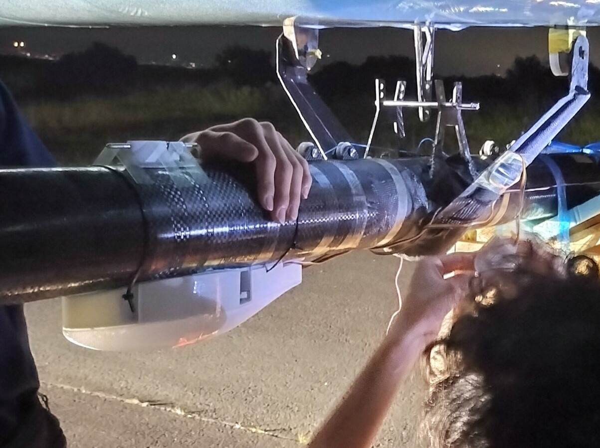 |

基盤と基板 BOX

| | **メイン基板** | **TB 基板** |
| :--- | :--- | :--- |
| 基板 | 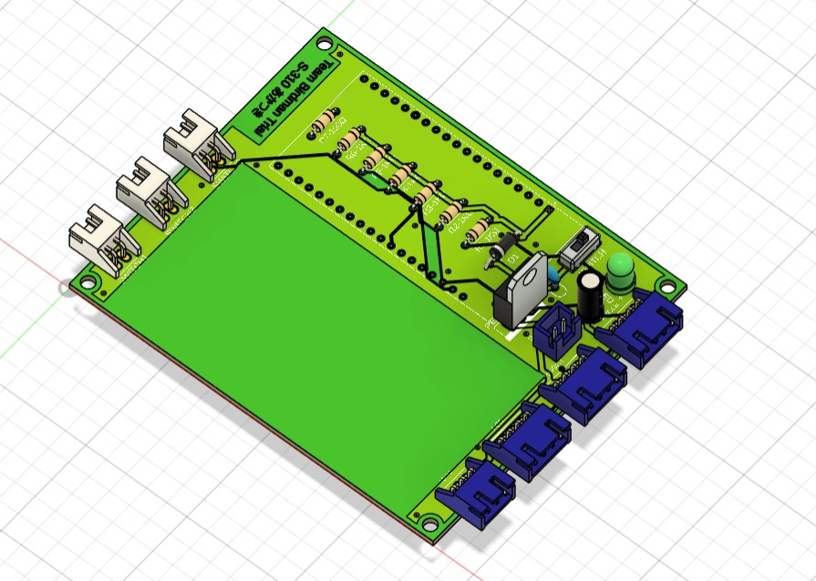 | 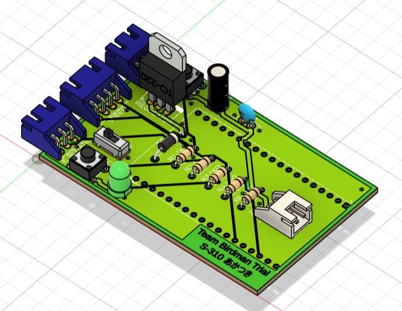 |
| 基板マウント | 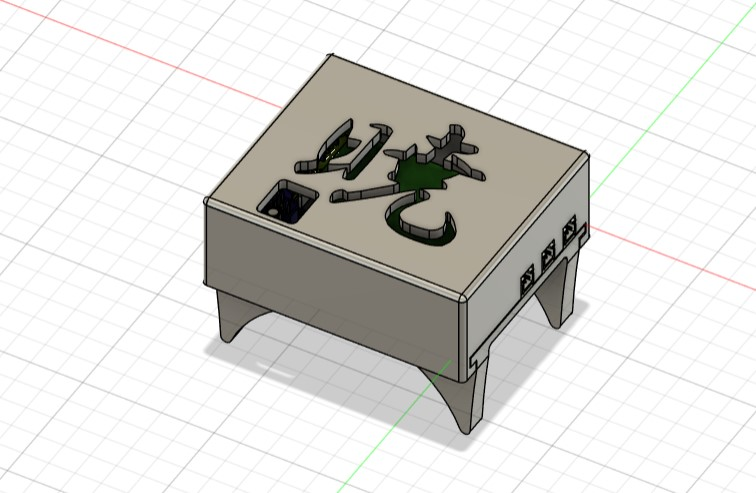 | 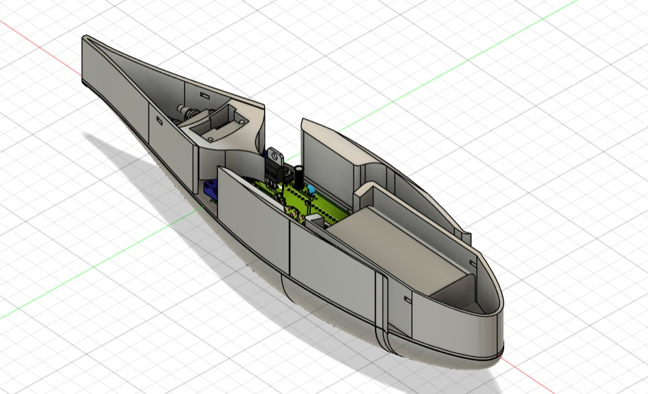 |

## 4. メイン基板の設計

### 4.1 要件

メイン基板の要件は、以下の通りである。

| 構成要素 | 詳細 |
| --- | --- |
|　制御　| ESP32 32E|
| バッテリー | `18650 リチウムイオン電池`を 2 個直列|
|　高度計　| 超音波センサ ※1 |
| 姿勢角計 | 9 軸センサ ※1 |
| 回転数計 | フォトインタラプタ ※1 |
| トリムボタン | タクトスイッチを3個搭載 ※1 |
|表示器| LCD 1602 |
| 設置場所 | コックピット内 ※2 |

> ※1 基板発注後、高度計のみの使用に変更。型番詳細は、[1. 計測機器一覧と仕様](#1-計測機器一覧と仕様)参照。  
> ※2 [3. 機器配置と実装](#3-機器配置と実装)参照。

<!-- 以下は文章の例です

メイン基板の制御はすべてESP32 32Eで行った。

バッテリーに関しては、ESP32に安定した電力供給を行うことと、LCD1602の駆動を目的に、3.6Vの`18650 リチウムイオン電池`2個を直列で使用した。

計器類に関して基板設計当初は、高度計、姿勢角形、回転数系、トリムボタンを搭載予定であったが、最終的には高度計のみメイン基板には実装した。

その理由としてまず、LCD1602と姿勢角形の互換性の問題があり、この二つの同時駆動が困難だったため、姿勢角形はTB基板に移行した。

回転数計は、駆動設計者に依頼されたため搭載予定だったが、サイクルコンピューターの表示のみで十分との結論になったため、搭載しなかった。

トリムスイッチは、Androidアプリの操作用に搭載予定だったが、製作過程でアプリのUIのみで十分との結論に至ったため最終的には搭載しなかった。

LCD1602には、舵角と姿勢角のデータを優先で表示した。当初はアプリの表示のみの予定だったが、初期のTFで通信問題が発生し、信頼性を上げるために重要な情報を有線でも表示するよう修正した。

設置場所の詳細は、[3. 機器配置と実装](#3-機器配置と実装)を参照してください。

 -->

### 4.2 設計思想

メイン基板の設計においては、コックピット内という限られたスペースへの実装を考慮し、「**コンパクト性**」、「**取り付けの容易性**」、「**デザイン性**」の 3 点を特に重視した。

**コンパクト性（省スペース性）**  ESP32 の下部スペースに可変抵抗を配置し、バッテリー設置スペースも基板上に一体化して確保した。これによりメイン基板全体の使用スペースを削減し、コックピット内の任意の位置へ設置可能な設計とした。

**取り付けの容易性**  マウント製作には、形状自由度の高い 3D プリンタを導入した。マウント下部のパーツを事前に機体フレーム（桁）に固定し、基板を格納した上部パーツをスライドして差し込むだけで固定が完了する機構とした。従来の結束バンドによる固定と比較し、接合時間を大幅に削減するとともに、トラブル時のメンテナンス性も向上させた。

**デザイン性** マウント上部にはコンセプトネームをデザインした。また、コネクタを均等に配置し、電源用トグルスイッチへのアクセス性を高めるなど、操作性も考慮した。電源 ON の状態は、あかつき色の LED で明示する。

### 4.3 作成手順

以下の手順で作成した。

**1. 回路設計・動作確認** 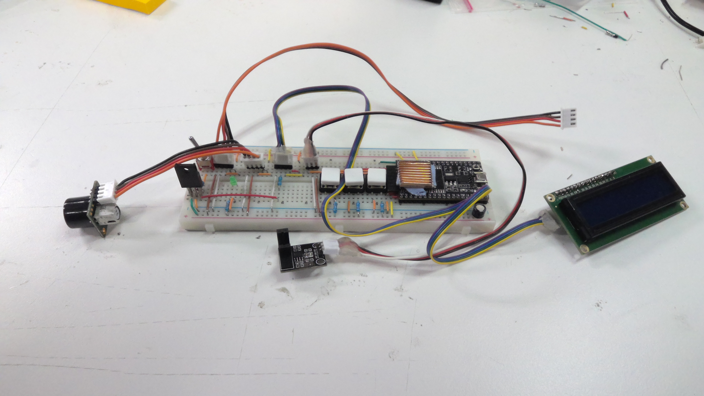 まず、ブレッドボード上で要件を満たす回路を組み、適当なプログラムで動作チェックを行う。理論上は動く回路であっても、電流や電圧の関係で動かない可能性があるため、PCB ソフトで設計する前に必ず行うべきである。

**2. 回路図作成** 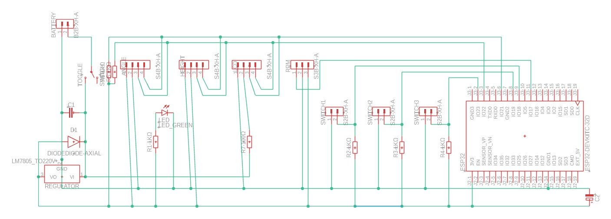 PCB ソフト（Fusion PCB（旧 Eagle））上で、ブレッドーボードで動作確認した回路と、同じ回路を作成する。

**3. 電子部品の配置決め** 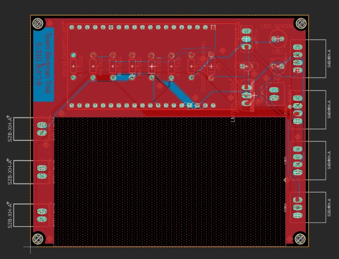 回路図ドキュメントから PCB ドキュメントに切り替え、部品の配置を決める。出来るだけコンパクトになるよう意識する。電源周りなど、電流が多く流れるところは太くする。さらに、ベタグラウンドを行いノイズを削減する。最後にオートルータで回路を生成する。

**4. 出来上がり確認、基板発注**  3D に起こし、干渉を確認する。問題なければ会社に発注する。310 では JLCPCB を利用した。

**5. マウント作成**  基板の 3D データをベースに、基板マウントを Fusion で設計する。アセンブリ出来るかや、強度なども考慮する。

### 4.4 課題・反省点

メイン基板に関する運用後の課題や反省点をあげる。

第一に、発注後の仕様変更が多かった点が挙げられる。基板発注後に、仕様変更で使用しなくなった計器が多数あり、結果として無駄なコネクタが増えた。当初から仕様が確定していれば、基板サイズを更にコンパクトにできた可能性がある。

第二に、電流・電圧に関する詳細な計算を行っていなかった点である。ブレッドボード上で動作したことをもって「良し」としており、電流・電圧に基づく抵抗やコンデンサの選定が不十分であった。これが LCD 点灯時の不具合の一因になったと推測される。また、18650 電池 2 本の 7.4V から降圧する際の電力損失も大きかった。

第三に、重量に対する意識が不足していた点である。他班が数グラム単位での軽量化に努める中、基板やマウントに余分な箇所が多く残った。例えば、18650 電池ボックス設置スペースの下に基板領域は必ずしも必要なかった。

## 5. TB 基板の設計

### 5.1 要件

TB 基板の要件は以下の通りである。

| 構成要素 | 詳細 |
| --- | --- |
|　制御　| ESP32 32E|
| バッテリー | 18650 リチウムイオン電池を 2 個直列|
|　機速計　| ピトー管、差圧センサ |
| 姿勢角計 | 9 軸センサ ※1 |
| 舵角計 | ポテンショメーター ※1 |
| 0点ボタン | タクトスイッチを4個搭載 |
| 設置場所 | 尾翼付近 ※2 |

> ※1 メイン基板でLCD1602と姿勢角形の電源互換性問題が生じたため、姿勢角形をTB基板に移行。型番詳細は、[1. 計測機器一覧と仕様](#1-計測機器一覧と仕様)参照。  
> ※2 [3. 機器配置と実装](#3-機器配置と実装)参照。

<!-- 以下は文章の例です

TB基板の制御はすべてESP32 32Eで行った。

バッテリーに関しては、ESP32に安定した電力供給を行うことと、LCD1602の駆動を目的に、3.6Vの`18650 リチウムイオン電池`2個を直列で使用した。

計器類に関して基板設計当初は、機速計、舵角系のみをTB基板に搭載予定であったが、姿勢角形をTB基板に移行することになった。

その理由としてまず、LCD1602と姿勢角形の互換性の問題があり、この二つの同時駆動が困難だったため、姿勢角形はTB基板に移行した。

機速計に使用している差圧センサーは、I²Cのものを採用していたため、基板発注後であったが、同じくI²Cの姿勢角計の移行はスムーズに行うことができた。

舵角計は、ERマウント部分にポテンショメーターを装着し、この変化によって読み取りを行う。試験毎に0点位置を確認し、ERそれぞれのトリムボタンを用いて0点補正を行う。

設置場所の詳細は、[3. 機器配置と実装](#3-機器配置と実装)を参照してください。

 -->

### 5.2 設計思想

TB 基板はテールビームに取り付けるため、「コンパクト性」「抗力低減」「熱対策」の 3 点を特に意識した設計とした。

**コンパクト性**  テールビームの円筒形状に合わせ、細長くコンパクトな形状にする必要があった。マウント上部を桁に沿うように円形にし、取り付けも容易にした。すべての部品を密集させ、無駄なスペースを排除した。また、コンパクト化は、マウントを製作する 3D プリンタの印刷可能域に収める上でも必須であった。

**抗力低減** マウントの形状を翼型とすることで、抗力低減を図った。特にマウント下部のパーツは、積層痕が残りにくいよう、フィラメントを一度も止めず螺旋状に印刷する設定を採用し、表面を滑らかに仕上げることで抗力を低減している。

**熱対策** TB 付近は太陽光が直接当たり高温になるため、マイコンの温度上昇抑制が課題であった。対策としてマウントにインテイクとアウトテイクを設置し、飛行中の対気速度を利用してマイコンの CPU を冷却できる構造とした。

### 5.3 作成手順

作成手順はメイン基板と同様のため省略する。関連図面のみを掲載する。

| **回路図** | **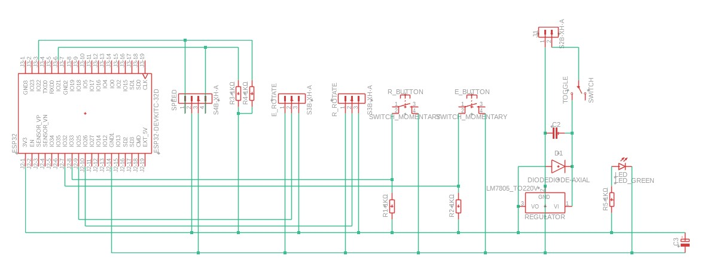** |
| :--- | :--- |
| 2D | 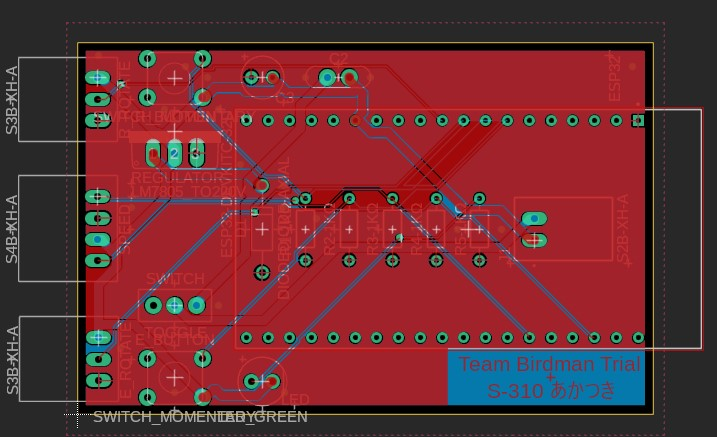 |
| 3D |  |
| マウント |  |

### 5.4 課題・反省点

TB 基板に関する運用後の課題や反省点をあげる。

第一に、抗力や風の流れに関する定量的な解析を行っていない点である。翼型マウントによる抗力低減効果は推測の域を出ず、CFD（数値流体力学）などを用いた解析を行うべきであった。

第二に、メイン基板と同様、重量に対する意識が不足していた点である。

第三に、ピトー管（機速計）の信頼性に関する問題である。キャリブレーションが未実施である点や、プロペラ後流の影響を受ける設置場所であった点から、計測データの信頼性が低い状態であった。次年度以降は、風洞を用いた校正の実施と、キングポストなど影響の少ない場所への設置変更を検討すべきである。

第四に、防水対策の不備である。TF（テストフライト）時、結露により TB が濡れることがあったが、その水滴がマイコンに付着する恐れがあった。実際には、マウントと TB 間の緩衝用スタイロフォームが水分を吸収したため事なきを得たが、いつマイコンが短絡・故障してもおかしくない状態であった。

第五に、最重要計器である舵角計の不具合である。これについては次項で詳述する。

## 6. 舵角計の設計

### 6.1 要件

舵角計の要件は以下の通りである。

| **舵角計要件** |
| :--- |
| 310 では初めて WL（Weight-shift Control）を採用したが、センタリング機構が無いため、舵角をパイロットに伝え、パイロットはそれを注視して操縦する必要がある |
| リンケージ索に使用したダイニーマロープは伸縮性が大きく、操縦桿のニュートラル位置が不定となるため、尾翼側で直接舵角を計測する必要がある |
| 尾翼付近で取得した舵角データをコックピット内のメイン基板に無線で送信し、パイロットに提示する 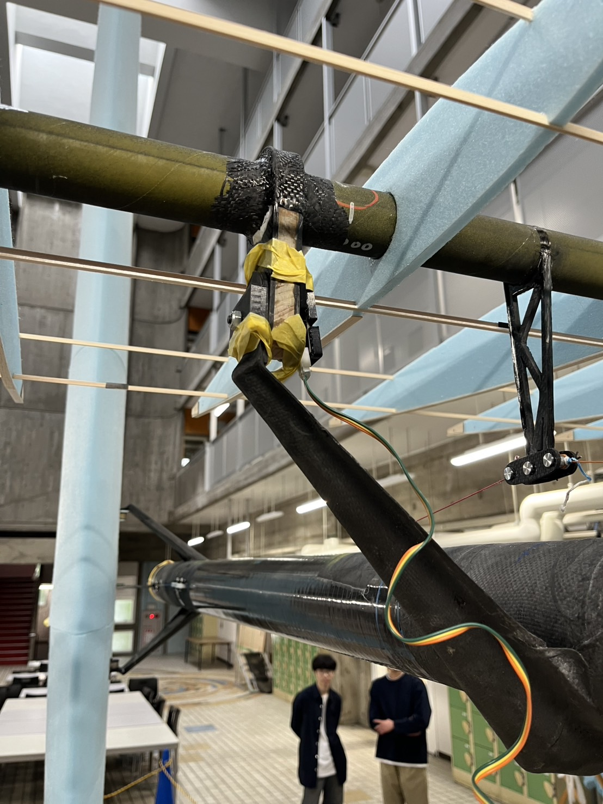 |

### 6.2 設計思想

舵角計は、S310 機体の操縦系統において不可欠な要素であった。センタリング機構を持たない機体特性上、舵角情報が無ければ安全な操縦が困難であるため、他のどの計器よりも優先して設計、製作、およびテストを実施した。

設計の核心は、飛行中の脱落を確実に防止する「固定信頼性」と、不具合発生時に迅速に交換できる「メンテナンス性」の両立であった。
このため、スナップフィット機構（下記写真参照）を採用し、尾翼の回転軸（ボルト）へポテンショメータを容易に取り付けられる構造を目指した。
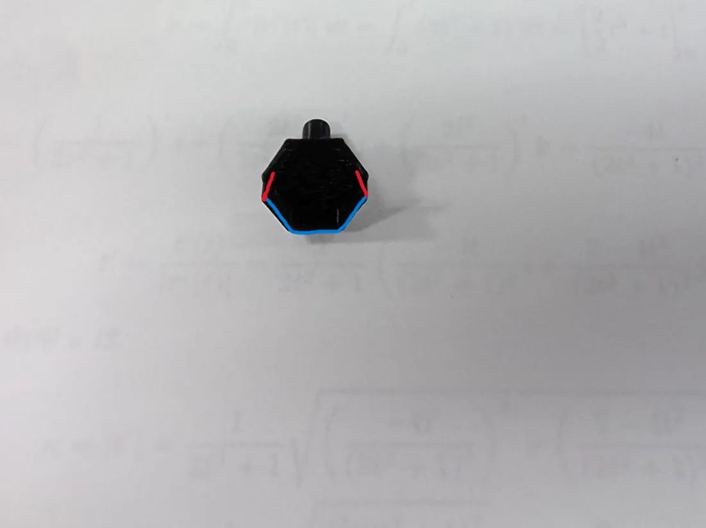

### 6.3 課題・反省点

運用を通じて明らかになった舵角計の課題と反省点は、以下の通りである。

**舵角計のずれ**
ドリフトにより、舵角計が示すニュートラル位置が頻繁にずれる問題が発生した。
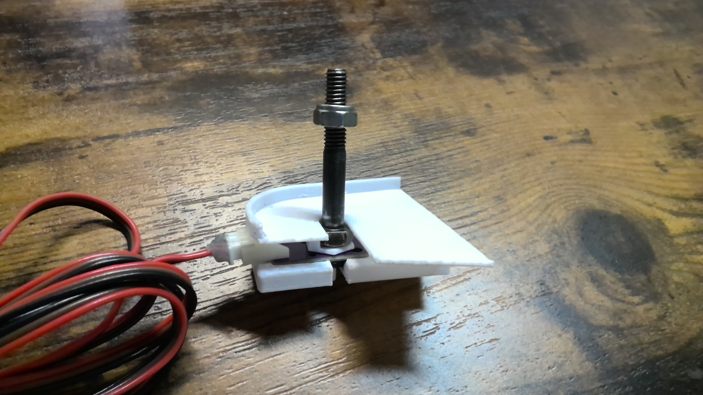
原因は主に 2 点考えられる。
第一に、尾翼回転時にロックナットが共回りしたことである。舵角計は、回転軸であるボルト・ナット自体は回転しないことを前提とした機構であった。この問題は、ロックナットを 2 個使用するダブルナット構造とし、ナットの空転を防止することで改善を図った。
第二に、着脱性を高めるために導入したスナップフィットがボルトに密着せず、尾翼の回転が舵角計へ正確に伝達されない「滑り」が発生したことである。

**取り付け作業の困難さ**
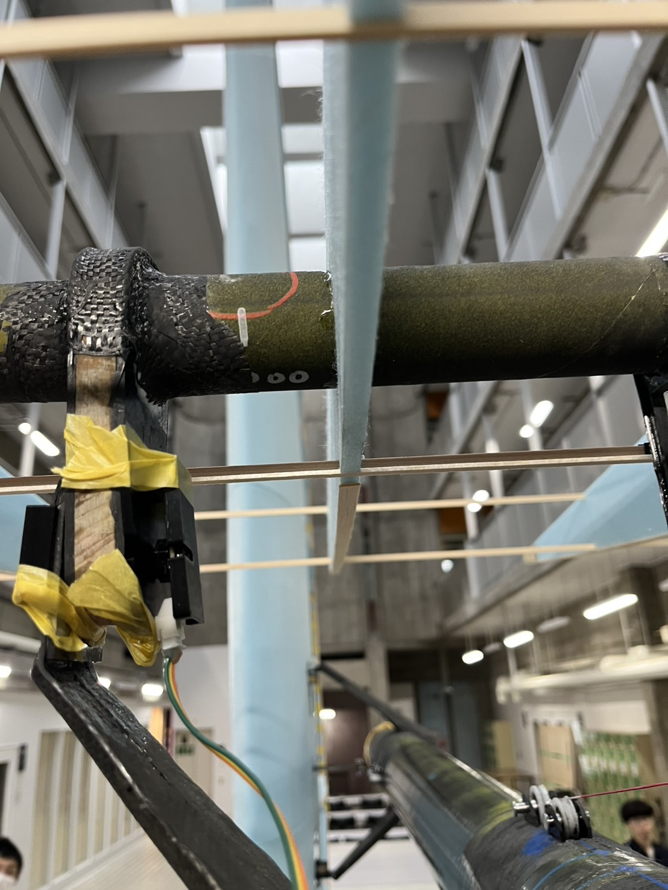
スナップフィットの採用により取り付け性能の向上を目指したが、前述の「滑り」を抑えるため、結局はマスキングテープを巻き付けて補強固定する必要があった。これにより接合に時間を要し、本来の「容易な着脱」という目的を達成できなかった。確実な固定と作業性を両立できる、新たな固定方法の再検討が求められる。

## 7. データ取得と統合

各センサーからのデータは ESP32 を介して周期的に取得される。
I²C 通信デバイスは同一バス上でアドレス分離され、姿勢・速度・高度・舵角の各データを同周期（約 10Hz）で統合する。
データは Android アプリおよび Firebase に送信され、飛行ログとして蓄積・可視化される。

## 8. センサーキャリブレーション方法

- 高度計  
  測定範囲が 20cm~765cm なので、地面から 20cm の地点に設置し、その値を 0 として測定

- 姿勢角計
  起動時に初期値を 0 として、そこからのずれ角度で計算
  時間がたつとズレが生じ、特にヨーのずれがひどかったため、リセット処理も追加しようとしたが未実装 - ヨー  
   補正式

      ```c++
      // --- 磁気センサキャリブレーション（回転しながら実行） ---
      if (calibrateMag) { /* ... 最大・最小値の更新 ... */ }

      // ハードアイアン補正
      float magOffsetX = (magMaxX + magMinX) / 2.0;
      float magOffsetY = (magMaxY + magMinY) / 2.0;
      float correctedMagX = magRaw.x - magOffsetX;
      float correctedMagY = magRaw.y - magOffsetY;
      ```
      センサーを回転させたときの地磁気の最大値・最小値を記録
      最大値と最小値の中央値をオフセットとして、現在の地磁気生データ（magRaw）から差し引くことで補正

      計算式
      ```c++
      // チルト補正付き磁気方位角の計算
      float xh = magRaw.x * cos(pitchRad) + magRaw.z * sin(pitchRad);
      float yh = magRaw.x * sin(rollRad) * sin(pitchRad) + magRaw.y * cos(rollRad) - magRaw.z * sin(rollRad) * cos(pitchRad);

      float heading = atan2(yh, xh) * 180.0 / PI;

      // --- 地磁気に基づくyawの更新 ---
      yaw = 0.90 * yaw + 0.10 * heading;
      ```
      機体が傾いている（ロールやピッチがある）場合、地磁気の値が歪むため、**ロール（rollRad）とピッチ（pitchRad）を使ってその影響を打ち消す（チルト補正）

      地磁気で計算した新しいheading（方位）と、以前のyaw（ヨー）を**重み付けして平均する（相補フィルターや簡易的なカルマンフィルターの考え方）**ことで、ヨー角をスムーズに更新

      - ロール、ピッチ
      初期値からのずれ角度を計算
      ```c++
      // --- ロール・ピッチ計算 ---
      float accRoll = atan2(accRaw.y, accRaw.z) * 180.0 / PI;
      float accPitch = atan2(-accRaw.x, sqrt(accRaw.y * accRaw.y + accRaw.z * accRaw.z)) * 180.0 / PI;

      roll  = alpha * roll  + (1.0 - alpha) * accRoll;
      pitch = alpha * pitch + (1.0 - alpha) * accPitch;
      ```

      前の角度（roll, pitch）に重みalpha（ジャイロの寄与）をかけ、加速度計の角度に重み(1.0 - alpha)をかけて加算する **相補フィルター（Complementary Filter）** 使用

## 9. まとめ

計測機器群は、軽量・低消費電力・高信頼性を指針として選定した。  
I²C 通信による共通化およびコネクタ統一設計により、再現性の高い配線構成とメンテナンス性を実現している。  
また、センサー配置を流体・構造設計と整合させることで、飛行時のデータ精度を確保した。

> 計器主担当：[tttt10231023](https://github.com/tttt10231023)  
> 著：[norahshion](https://github.com/norahshion)
